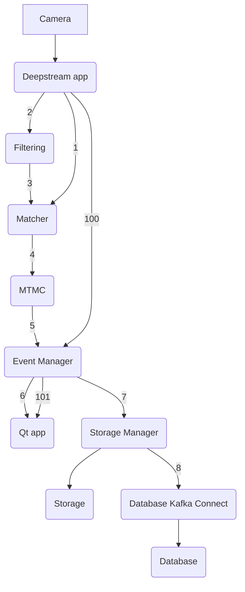
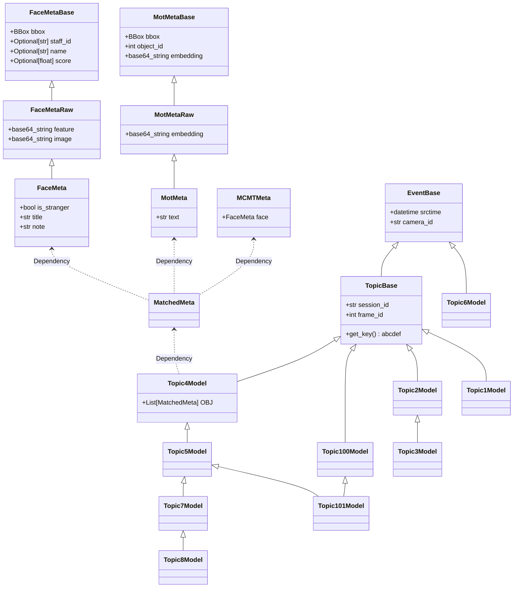

# Checkout wiki

## Usage

- When create services using python, one can use `data_schemas/data_schema.py` to easily create/parse topic messages
- When setup a new kafka system, use `data_schemas/create_topics.py` to create topics

## Data flow (copied from the wiki)

## class diagram of schemas

